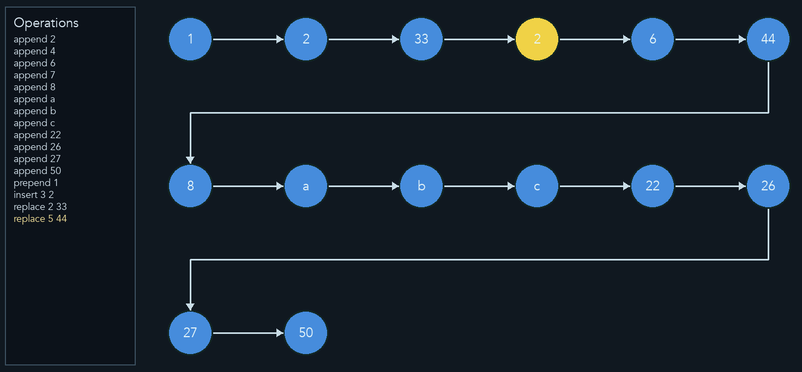

# Linked List Visualizater
### This project allows for the creation of linked lists with the following operations
* append
* prepend
* insert
* remove
* replace
* reverse

Linked List can be generated from a comma-separated list of values or from an operations file.  They can be
printed to the command line or displayed graphically with animation.

### Requirements
- Python 3.12+
- `pygame` installed in your environment

### Installation
Create/activate a virtual environment, then install dependencies:
```bash
python -m venv .venv
source .venv/bin/activate
pip install pygame
```

## Usage
Run with a comma-separated list of values (defaults to `1,2,3,4,5,6,7,8,9,10`):
```bash
> python main.py singly print --values 1,2,3,4,5

Singly Linked List | 5 Elements:
[1 ⇒ 2 ⇒ 3 ⇒ 4 ⇒ 5]
```

Run from an operations file (examples included: `ops1.txt`, `ops2.txt`):
```bash
> python main.py doubly print --operations-file examples/ops3.txt

Doubly Linked List | 13 Elements:
[1 ⇔ 4 ⇔ 2 ⇔ 6 ⇔ 7 ⇔ 8 ⇔ 10 ⇔ 15 ⇔ 20 ⇔ 22 ⇔ 26 ⇔ 27 ⇔ 50]
```

If an operations file is provided and `--values` is omitted, the visualization starts from an empty list and only replays the operations.

**Arguments**
- `lltype`: `singly` or `doubly` linked list
- `display`: `print` or `animate`
- `--values`: Comma-separated list of node values (default uses `DEFAULT_VALUES`).
- `--operations-file`: Path to a text file of operations (see format below).
- `--node-interval`: Seconds per node animation (default `0.4`).
- `--arrow-interval`: Seconds for arrow animation (default `0.4`).
- `--width`: Window width in pixels (default `1000`).
- `--height`: Window height in pixels (default `500`).

**Operations File Format**
Each line is a single operation. Blank lines and lines starting with `#` are ignored.
- `append <value>`
- `prepend <value>`
- `insert <index> <value>`
- `remove <index>` (alias: `delete`)
- `replace <index> <value>`
- `cycle <start_index>`
- `has_cycle`

**Example: `ops1.txt`**
```text
append 2
append 4
append 6
append 7
append 8
append 10
append 15
append 20
append 22
append 26
append 27
append 50
prepend 1
insert 3 2
remove 1
```

**Example: `ops2.txt`**
```text
append 2
append 4
append 6
append 7
append 8
append a
append b
append c
append 22
append 26
append 27
append 50
prepend 1
insert 3 2
replace 2 33
replace 5 44
```

**Screenshot**

